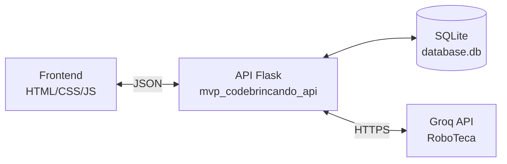

# CodeBrincando – Backend (API Flask)

Este backend foi desenvolvido em **Flask** e funciona como o cérebro do CodeBrincando.  
Ele é responsável por:

- cadastrar e gerenciar usuários
- entregar explicações iniciais de programação
- fornecer desafios (HTML, CSS etc.)
- verificar as respostas enviadas pelas crianças
- registrar progresso
- conversar com a API externa **Groq** para gerar respostas da robô tutora **RoboTeca**

O objetivo é manter tudo simples, didático e pronto para rodar tanto localmente quanto em Docker.

---

## Tecnologias usadas

- **Python 3.11**
- **Flask** para criação da API
- **SQLite** como banco de dados local
- **Requests** para comunicação com a Groq API
- **Docker** para empacotamento do backend
- **Swagger/Flasgger** para documentação automática das rotas

---

## Arquitetura geral

Fluxo principal da aplicação:

1. O backend recebe chamadas do frontend (login, desafios, dúvidas etc.).
2. Ele consulta ou atualiza o banco SQLite.
3. Para dúvidas das crianças, ele envia uma solicitação à API externa Groq, que gera a resposta da RoboTeca.
4. O resultado volta para o frontend em formato JSON.

### Diagrama da Arquitetura



---

## Instalação (rodar localmente)

Requisitos:

- Python 3.10 ou 3.11
- pip
- Git

### 1. Clonar o projeto

```bash
git clone NOME_DO_SEU_REPOSITORIO.git
cd mvp_codebrincando_api
```

### 2. Criar ambiente virtual (opcional, mas recomendado)

Mac/Linux:

```bash
python3 -m venv venv
source venv/bin/activate
```

Windows:

```bash
python3 -m venv venv
source venv/bin/activate
```

### 3. Instalar dependências

```bash
pip install -r requirements.txt
```

### 4. Definir sua chave de API da Groq

A RoboTeca usa a API gratuita da Groq.  
Crie sua chave em: **https://console.groq.com/**

Depois configure no terminal:

Mac/Linux:

```bash
export GROQ_API_KEY="SUA_CHAVE_AQUI"
```

Windows PowerShell:

```powershell
setx GROQ_API_KEY "SUA_CHAVE_AQUI"
```

### 5. Rodar a API

```bash
python app.py
```

A API ficará acessível em:

```
http://127.0.0.1:5001
```

---

## Endpoints principais

| Método     | Rota                      | Descrição                           |
| ---------- | ------------------------- | ----------------------------------- |
| **POST**   | `/cadastrar_usuario`      | cria um novo usuário                |
| **PUT**    | `/usuarios/<id>`          | atualiza nome/idade                 |
| **DELETE** | `/usuarios/<id>`          | remove o usuário e seu progresso    |
| **GET**    | `/explicacoes`            | retorna explicações iniciais        |
| **GET**    | `/progresso/<usuario_id>` | lista desafios + status             |
| **POST**   | `/progresso`              | envia código para verificação       |
| **POST**   | `/ajuda-bot`              | envia dúvida para a RoboTeca (Groq) |
| **GET**    | `/`                       | rota simples de status da API       |

---

## Uso da API Externa (Groq)

A API utiliza o modelo **LLaMA 3.1 8B Instant**, oferecido gratuitamente pela Groq.

### Sobre a licença

- API pública
- Gratuita
- Cadastro simples usando e-mail
- Chave privada necessária (enviada em seguraça no privado)

### Rotas utilizadas

A API usa apenas **uma rota** da Groq:

```
POST https://api.groq.com/openai/v1/chat/completions
```

Com o seguinte formato:

```json
{
  "model": "llama-3.1-8b-instant",
  "messages": [{ "role": "user", "content": "mensagem pedagógica aqui" }]
}
```

A resposta é usada para gerar explicações amigáveis para as crianças.

---

## Como rodar o backend com Docker

1. Abra o terminal e vá para a pasta do backend:

```bash
cd mvp_codebrincando_api
```

2. Criar a imagem:

```bash
docker build -t mvp_codebrincando_api .
```

3. Executar o container:

```bash
docker run -d -p 5001:5001 \
    -e GROQ_API_KEY="SUA_CHAVE_AQUI" \
    --name mvp_codebrincando_api \
    mvp_codebrincando_api
```

4. Ver logs:

```bash
docker logs mvp_codebrincando_api
```

5. Parar o container:

```bash
docker stop mvp_codebrincando_api
```

6. Remover:

```bash
docker rm mvp_codebrincando_api
```

---

### Documentação Swagger

A API possui documentação automática gerada pelo Swagger (Flasgger):

👉 http://127.0.0.1:5001/apidocs/

---

## Estrutura dos arquivos

```
mvp_codebrincando_api/
│── app.py
│── database.db
│── requirements.txt
│── Dockerfile
│── README.md
```

---

## Dockerfile usado

```dockerfile
FROM python:3.11-slim

WORKDIR /app

COPY requirements.txt .
RUN pip install --no-cache-dir -r requirements.txt

COPY . .

EXPOSE 5001

CMD ["python", "app.py"]
```

---
